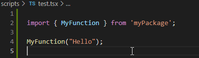

# PackageNavigator

PackageNavigator allows you to navigate to implementation in external codebases that you have locally.

## Features

Navigate to external code with the "Navigate to Implementations" command.

## Extension Settings

This extension contributes the following settings:

* `packagenavigator.packages`: Configure what packages to look for. Format is array of [packageName, localPath], e.g. [["@types/vscode", "C:/Example/vscodetypes"], ["@types/glob", "C:/Example/globtypes"]].

## Release Notes

### 1.0.0

Initial release of PackageNavigator
